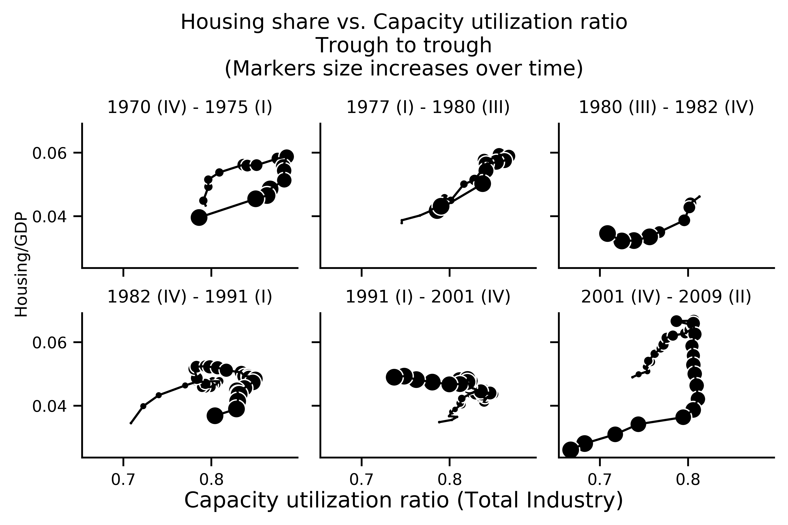
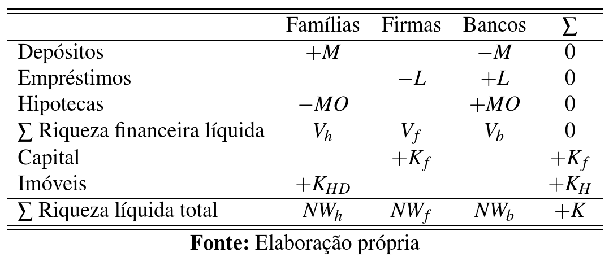
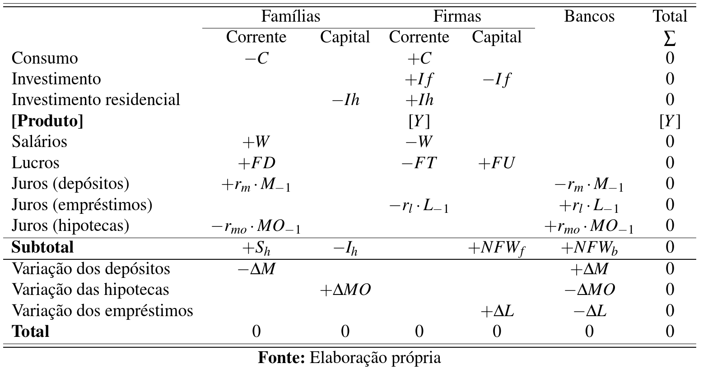
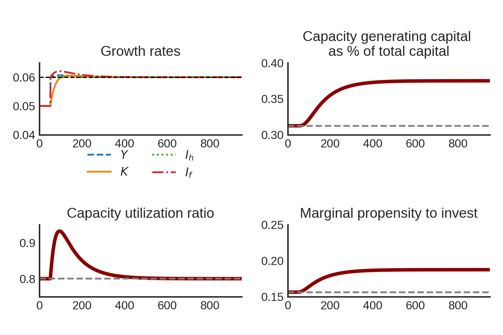
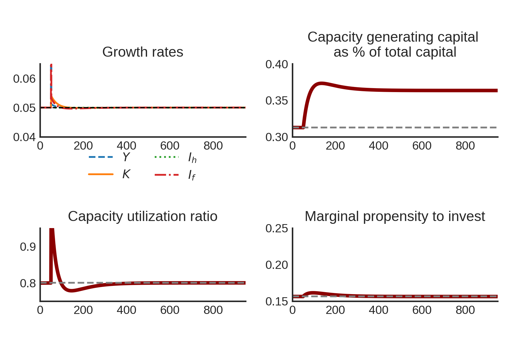
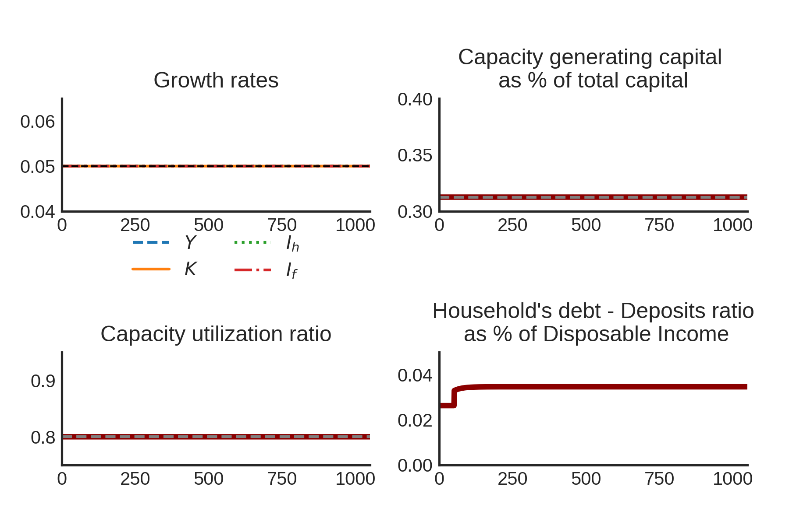

```{r setup, include=FALSE}
knitr::opts_chunk$set(echo = TRUE)
youngmetro::metro_beamer(fig_caption = FALSE)
```

## Estrutura do artigo


\begin{block}{Pergunta}
Como e por que incluir o investimento residencial em um modelo de crescimento heterodoxo?
\end{block}

1. Contextualização empírica
2. Revisão da literatura
3. Modelo SFC-SSM

\begin{alert}{Atenção}
Resultado parcial da dissertação em andamento
\end{alert}


## Imóveis na metodologia SFC


## **Contextualização: EUA**




## Revisão da literatura

\begin{alert}{Problema deixado por Harrod}
Alternativas dentro da heterodoxia para resolver este problema:
\end{alert}

- Cambridge
- Kaleckiano tradicional (Oxford)
- Supermultiplicador Sraffiano (SSM)
- Kaleckiano híbrido (Kaleckiano  + SSM)

## Selecionando o modelo


\begin{figure}[htb]
    \label{diagrama}
    \begin{center}
    \resizebox{\textwidth}{!}{%
\begin{tikzpicture}[thick]
    \path[draw] (-4,0)  coordinate [label= left:Distribuição] (A)

            -- ( 0,4)  coordinate [label=above:Estabilidade] (C)
            -- ( 4,0)  coordinate [label=right:$u_N$] (B)
            -- cycle;
    \foreach \point in {A,B,C}
    \draw
        -- (0,2) node[anchor=north]{Supermultiplicador};
    \draw
        -- (-5,-0.15) node[anchor=north]{exógena};
    \draw
        -- (0,1.5) node[anchor=north]{Sraffiano};
    \draw
        -- (-1.75,3.2) node[anchor=north, rotate=45]{Oxford};
    \draw
        -- (1.75,3.2) node[anchor=north, rotate=-45]{Cambridge};
    \draw
        -- (0,0) node[anchor=north]{Harrod};
\end{tikzpicture}
}
\end{center}
\end{figure}

# Modelo SFC-SSM

## Matriz dos estoques



## Matriz dos fluxos



## Principais Equações


$$
Y = 
\begin{cases}
C  = \alpha\cdot W\\
I_f = h\cdot Y \hspace{5cm} \dot h = h_{t-1}\cdot\gamma_u (u-u_N)\\
I_h = Z = (1+\overline g_Z)I_{h_{t-1}} \hspace{2.5cm} \Delta MO = I_h
\end{cases}
$$


$$
K = K_f + K_h
$$


## Representação do modelo

\begin{figure}[h]

\center
\subfigure[ref1][Fluxos]{\includegraphics[width=6.5cm]{figs/DAG.png}}
\quad
\subfigure[ref2][Fluxos-Estoques]{\includegraphics[width=6.5cm]{figs/DAGEstoques.png}}
\end{figure}

## Solução analítica

$$
Y_t = \frac{1}{1-\omega -h_t}\cdot I_{h_t}
$$

$$
g = g_Z + \frac{h_{t-1}\cdot \gamma_u (u-u_N)}{1-\omega-h_t} 
$$


$$
u\to u_N: g \to g_Z \hspace{1cm} h^* = \frac{g_Z\cdot v}{u_N} \hspace{1cm} g_K = f\frac{\overline s\cdot \overline u_N}{\overline v}
$$

$$
\frac{K_h}{K} = 1 - \frac{h^*}{(1 - \omega)}
$$

## Choque em $g_Z$




## Choque em $\omega$



## Conclusões

- Nosso modelo reproduz as principais características do supermultiplicador sraffiano
    
    + $u\to u_N$
    + $g \to g_Z$
    + $\Delta \omega \nRightarrow g^*$: distribuição  não afeta a taxa de crescimento de longo prazo
    + Taxa de juros hipotecárias impacta endividamento das famílias apenas

- $\Uparrow g_Z \Rightarrow \Uparrow k$

\begin{alert}{Próximos passos} explorar os determinantes do investimento residencial
\end{alert}

# Obrigado!

## Unindo os pontos

\begin{alert}{Por que SSM?} Por dar a devida atenção aos gastos autônomos e por ser 
capaz de replicar
alguns fatos estilizados.
\end{alert}

\begin{alert}{Por que SFC?} 
\begin{itemize}
\item Rigor contábil 
\item Capacidade de mapear os fluxos e estoques
\end{itemize}
\end{alert}

\begin{alert}{Por que SFC-SSM?} Por adicionar um tratamento adequado das relações financeiras no SSM.
\end{alert}


## Solução analítica de $k$: Passo a passo

$$
k = \frac{K_f}{K}
$$

$$
\frac{K_f}{K_h} = \frac{g_Z\cdot v}{u_N\cdot (1 - \omega - h^*)}
$$


$$
\frac{K_f}{K_h} = \frac{h^*}{(1 - \omega - h^*)}
$$


$$
\frac{K_h}{K} = 1 - \frac{h^*}{(1 - \omega)}
$$


## Choque em $r_m$




## Referências centrais

Serrano (1995): Long Period Effective Demand and the Sraffian Supermultiplier

Leamer (2007): Housing **IS** the Business Cycle

Teixeira (2015): Crescimento liderado pela demanda na economia norte-americana nos anos 2000: uma análise a partir do supermultiplicador sraffiano com inflação de ativos

Brochier & Macedo e Silva (2018): A supermultiplier Stock-Flow Consistent model: the "return" of the paradoxes of thrift and costs in the long run? 