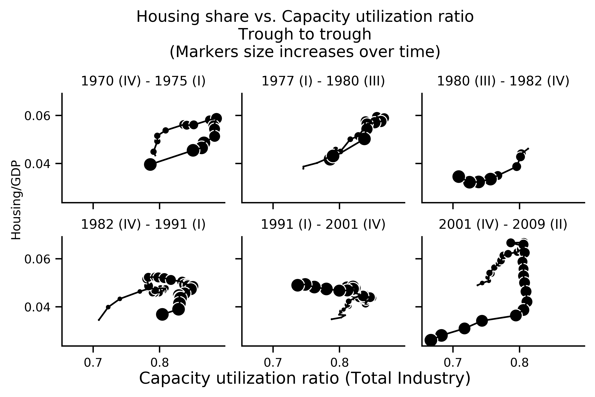
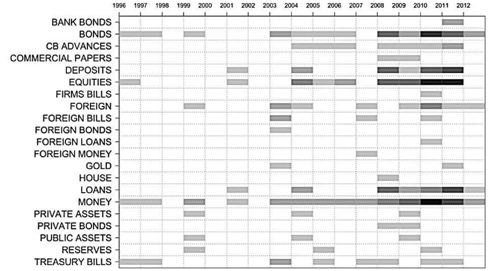
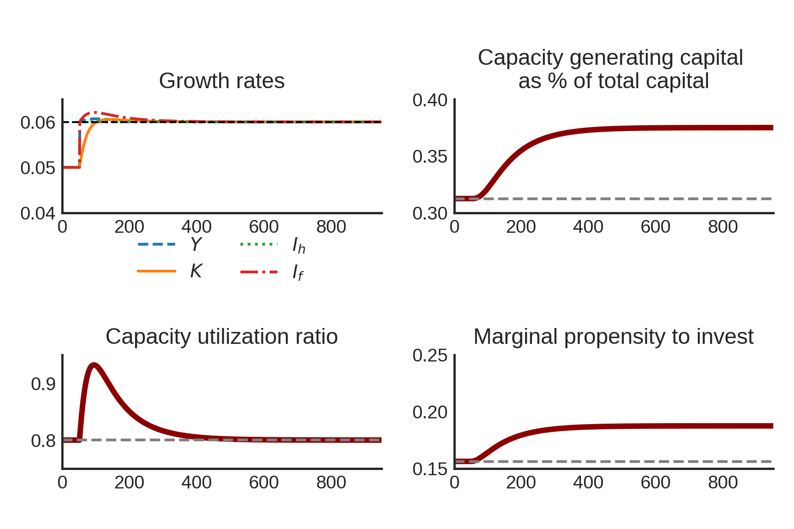
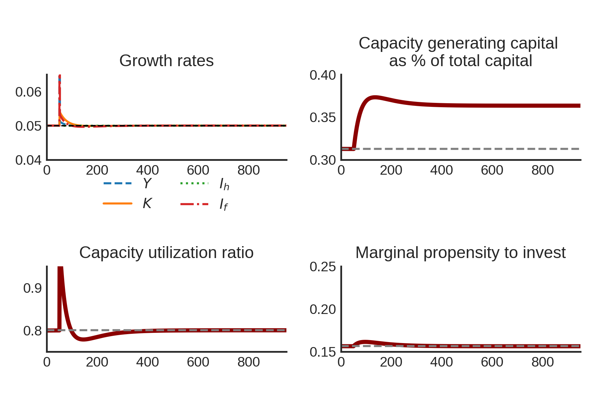

```{r setup, include=FALSE}
knitr::opts_chunk$set(echo = TRUE)
```

## Empirical motivation: U.S. Economy



???

 The vertical axis represents residential investment-GDP ratio and the horizontal axis represents the rate of capacity utilization as a **proxy for business cycle**.
 
**Recovery:** 
$$g_{I_h} > g \Rightarrow \Uparrow \frac{I_h}{Y} \, \text{and}\, \Uparrow u$$

Firms follow **the capital stock adjustment principle**: 

$$\Uparrow g_{I_f} \Rightarrow \Uparrow g > g_{I_h} \Rightarrow \Downarrow \frac{I_h}{Y} \, \text{and}\, \Downarrow u$$

In summary: US business cycles have the pattern "[f]irst homes, then cars,
and last business equipment"


---

## Empirical Literature

Non-capacity creating autonomous expenditures

- Freitas and Dweck (2013)
- Braga (2018)
- Girardi and Pariboni (2016, 2018)

Residential Investment 
  
- Green (1997)
- Leamer (2007)
- Fiebiger (2018)

???

- Freitas and Dweck present a growth accounting decomposition for the Brazilian economy (1970-2005)
- Braga (2018) shows evidence that economic growth and firms investment are explained by unproductive expenditures in Brazilian (1962-2015) 
- Girardi and Pariboni (2016) show that autonomous expenditures do cause long run effects on the growth rate. 

---


## Literature Review: Alternative Closures


**Harrod's question**: which are the conditions for a balanced growth between demand and supply?

Heterodox alternative closures:

- Cambridge
- Kalecki
- Sraffian Supermultiplier

???

Harrod's main goal in proceeding this way is to analyze the conditions for **balanced growth between supply and demand**

**Section goal:** analyses the trials to deal with Harrod's problem and verify at what cost they succeeded.

- **Cambridge:** growth rate determines the profit share (1 − ω) — and also the profit rate. Changes in functional distribution of income are the adjustment mechanism of the warranted rate of growth towards the actual one, ensuring the model stability.

- **Kalecki:** 

  + In economies where prevail market structures with oligopolies, prices would
be rigid even in the long run because of rigid mark-ups.
  + capacity utilization can be permanently different from the normal/planned one


--


???
  
- **Super:** presents exogenous distribution (as Harrod and Kaleck-
ian models), normal/planned degree of capacity utilization (as Cambridge16 ) and stability.

  + Feature of the model is the introduction of non-capacity creating autonomous expenditures. **That is the case of housing**.
  + Greater (smaller) rate of growth of non-capacity creating autonomous
expenditures will cause a greater (smaller) investment share in output


---

## Literature Review: autonomous expenditures

Hybrid neo-Kaleckian models:

- Allain (2015): public expenditures
- Nah and Lavoie (2017): exports

Sraffian Supermultiplier:

- Pariboni (2016), Mandarino, dos Santos and Macedo e Silva (ROKE, forthcoming): debt-financed consumption
- Brochier and Macedo e Silva (2019): fully specified SSM-SFC; wealth-financed consumption 

???

**Objective:** Special focus on how they incorporate non-capacity creating autonomous expenditures

- Allain: Gov financed by taxes
- Nah: Exports  as the main driver of growth
- Dutt (2006), Palley (2010) and Hein (2012): debt-financed consumption in a Kaleckian way
- Brochier: The results are at odds with the standard Sraffian Supermultiplier model

  +  produces a wage-led accumulation regime
  
**Main conclusion:** it is possible to realize an absence of residential investment-led growth models. We will present a first attempt to fill this gap

---

## Housing in SFC models



---
## Balance Sheet Matrix


???


**Our model is the most parsimonious as possible:** a closed economy without government sector.

**The novelty:**  introduce a second component to investment: residen-
tial investment

-  two types of real assets


---
## Transaction Flow Matrix and Flow of Funds 


???
- Households hold financial wealth as money deposits at banks (M), while finance their residential investment by mortgages (MO).

- Firms investment is fully induced by the level of effective demand, and its growth rate changes accordingly to the **capital stock adjustment principle**.

---
## Model Structure


$$
Y = C + I_f + I_h
$$

$$
C = \omega Y
$$

$$
I_f = h\cdot Y
$$

$$
I_h = Z
$$


--

.pull-left[

]

.pull-right[

]

---
## Model Solution I

Output level: 
$$
Y = \frac{1}{1-\omega - h}\cdot (I_h)
$$

Out of equilibrium growth rate:

$$
g = \overline g_{I_h} + \frac{\Delta h}{1-\omega-h}
$$


Equilibrium rate of growth:
$$
g = \overline g_{I_h}
$$

---
## Model Solution II

Firms investment share:
$$
h^* = \frac{g_{I_h}\cdot v}{u_N}
$$
Share of firms capital on total capital:

$$
\frac{K_f}{K} = \frac{h^*}{(1 - \omega)}
$$

---
## Numerical Simulations: increase of \\(g_Z\\)



???

Firms revise their investment plans accordingly to capital stock adjustment principle and **gradually increase their marginal propensity to invest**, causing **output to temporarily grow faster than residential investment**. 

$$\Uparrow h \to g > g_{I_h}$$

- greater investment share of output;
- residential investment growth rate causes a reduction of housing
share in total capital 

---
## Numerical Simulations: increase of \\(\omega\\)


???
- effects are just temporarily, because the rate of growth of residential investment does not change 
- has a permanent effect on **firms' capital share** of total capital

  + The increase of the wage has a level effect on output and on
output capacity, without affecting residential investment

**Increase in interest rate:** The only effect is a reduction
of households savings due to payments of interest on mortgages increasing more than interests on deposits received.
---
## Final Remarks

 - Our model preserves Sraffian Supermultipier main results 

- Increase of the wage-share does not increase long run growth rate

  + No paradox of costs

- A greater rate of growth of residential investment reduces houses share of total capital

- Further research: to investigate the determinants of residential investment 

---
## Next steps

- Including housing bubbles

$$
g_{I_h} = \phi_0 - \phi_1\cdot \overbrace{\left(\frac{1+r_mo}{1 + \dot p_h} - 1\right)}^{\text{own}}
$$


- Split between two classes and including more autonomous expenditures

$$
Z = I_h + C_k
$$

- Estimating a time series model (VEC)

$$
g_{I_h} \sim \text{own}
$$

- Inputing real data (own observable series) in the model

---
## Main References


Brochier & Macedo e Silva (2018): A supermultiplier Stock-Flow Consistent model: the "return" of the paradoxes of thrift and costs in the long run? 

Leamer (2007): Housing **IS** the Business Cycle

Serrano (1995): Long Period Effective Demand and the Sraffian Supermultiplier

Teixeira (2015): Crescimento liderado pela demanda na economia norte-americana nos anos 2000: uma análise a partir do supermultiplicador sraffiano com inflação de ativos

---

class: center, inverse, middle


# Thank you!
# Muito Obrigado!