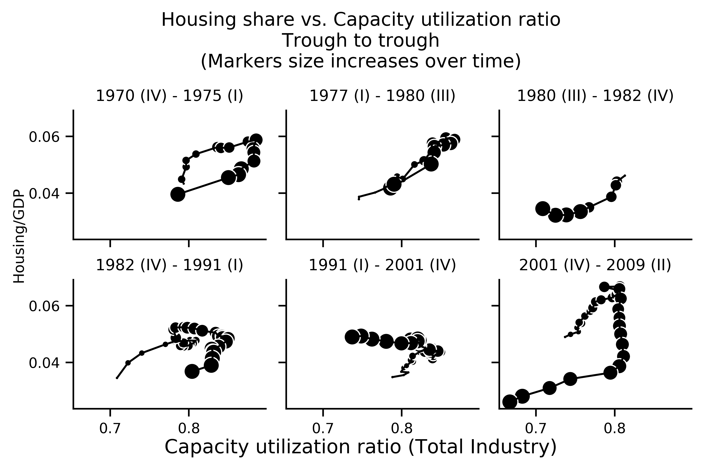
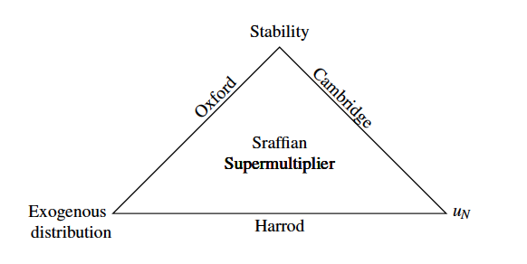
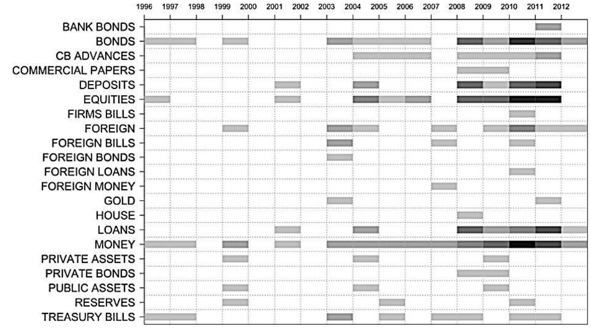
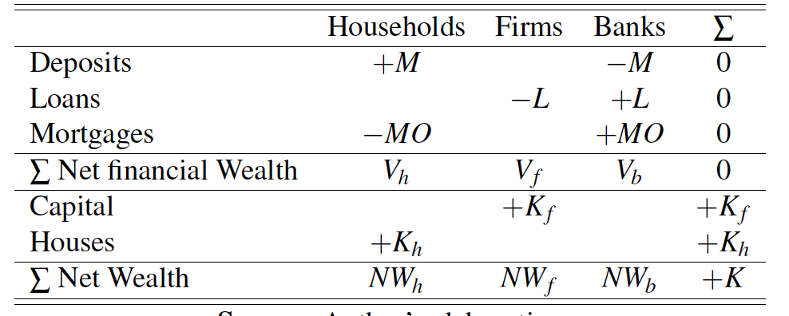
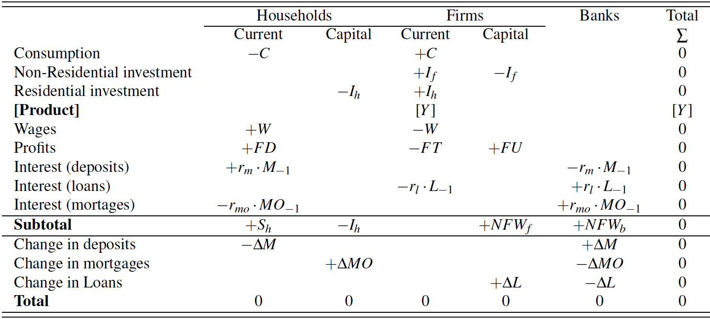
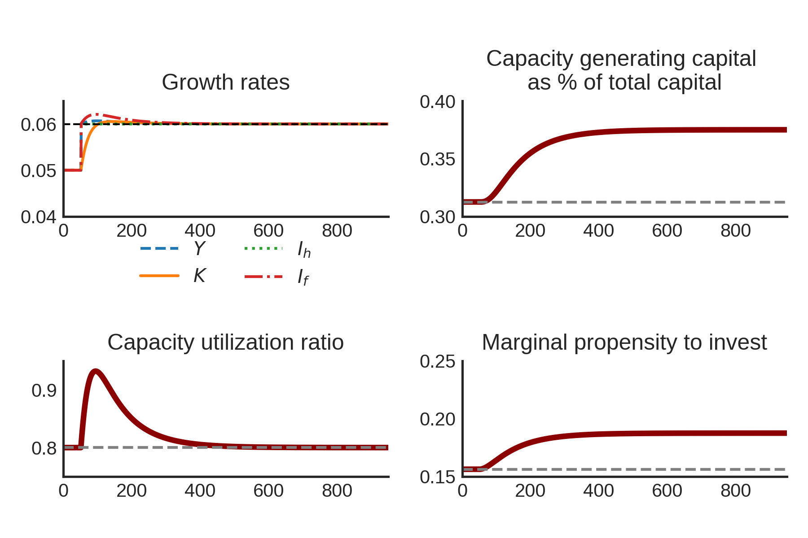
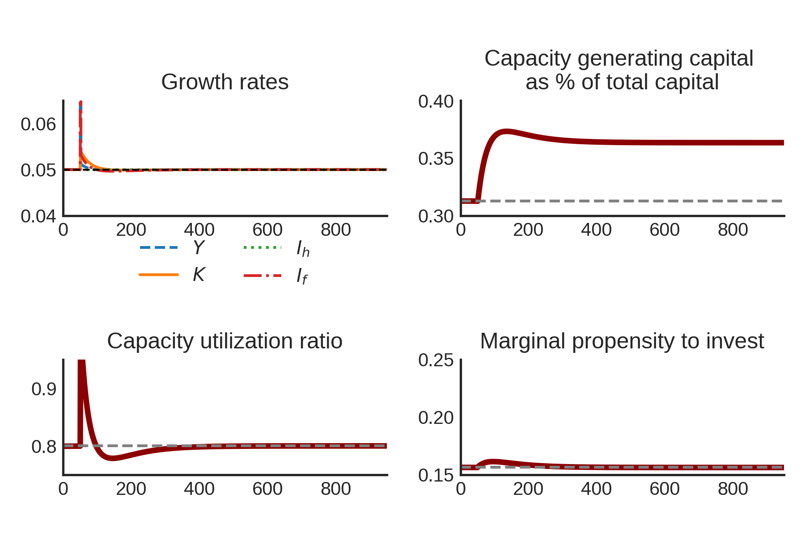
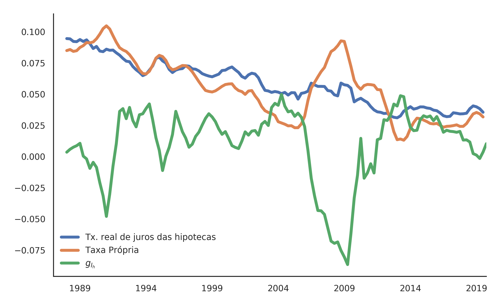

```{r setup, include=FALSE}
knitr::opts_chunk$set(echo = TRUE)
youngmetro::metro_beamer(fig_caption = FALSE)
```

## Summary

- Empirical motivation
- Review of the literature: demand-led growth models
- Stock-Flow Consistent Sraffian Supermutiplier model 


**Objective:** Include residential investment in a heterodox demand-led growth model


## Empirical Literature

Non-capacity creating autonomous expenditures

- Freitas and Dweck (2013)
- Braga (2018)
- Girardi and Pariboni (2016, 2018)

Residential Investment 
  
- Green (1997)
- Leamer (2007)
- Fiebiger (2018)


## Empirical motivation: U.S. Economy




## Literature Review: Alternative Closures


**Harrod's question**: which are the conditions for a balanced growth between demand and supply?

Heterodox alternative closures:

- Cambridge
- Kalecki
- Sraffian Supermultiplier

## Literature Review: Alternative Closures




## Literature Review: autonomous expenditures

Hybrid neo-Kaleckian models:

- Allain (2015): public expenditures
- Nah and Lavoie (2017): exports

Sraffian Supermultiplier:

- Pariboni (2016), Mandarino, dos Santos and Macedo e Silva (ROKE, forthcoming): debt-financed consumption
- Brochier and Macedo e Silva (2019): fully specified SSM-SFC; wealth-financed consumption 


## Housing in SFC models



## Balance Sheet Matrix



## Transaction Flow Matrix and Flow of Funds 



## Model Structure I

$$
Y = 
\begin{cases}
C_w =  W \\
I_f = h\cdot Y \hspace{5.25cm} \Delta h = h_{t-1}\cdot\gamma_u (u-u_N)\\
I_h = Z = (1+g_{I_h})\cdot I_{h_{t-1}} \hspace{2.5cm} \Delta MO = I_h
\end{cases}
$$


## Model Structure II

\begin{figure}[h]

\center
\subfigure[ref1][Flow dynamics]{\includegraphics[width=6.5cm]{figs/DAG.png}}
\quad
\subfigure[ref2][Stock-Flow dynamics]{\includegraphics[width=6.5cm]{figs/DAGEstoques.png}}
\end{figure}

## Model Solution I

Output level:
$$Y_t = \frac{1}{1-\omega -h_t}\cdot (I_{h})$$


Out of equilibrium growth rate
$$g = g_{I_h} + \frac{h_{t-1}\cdot \gamma_u (u-u_N)}{1-\omega-h_t}$$


Equilibrium rate of growth:
$$
g = \overline g_{I_h}
$$

## Model Solution II

Firms investment share:
$$
h^* = \frac{g_{I_h}\cdot v}{u_N} \hspace{1cm}
$$
Share of firms capital on total capital:

$$
\frac{K_f}{K} = \frac{h^*}{(1 - \omega)}
$$

## Numerical Simulations: increase of $g_Z$



## Numerical Simulations: increase of $\omega$



## Final Remarks

 - Our model preserves Sraffian Supermultipier main results 

- Increase of the wage-share does not increase long run growth rate

  + No paradox of costs

- A greater rate of growth of residential investment reduces houses share of total capital

- Further research: to investigate the determinants of residential investment 

## Main References


Brochier & Macedo e Silva (2018): A supermultiplier Stock-Flow Consistent model: the "return" of the paradoxes of thrift and costs in the long run? 

Leamer (2007): Housing **IS** the Business Cycle

Serrano (1995): Long Period Effective Demand and the Sraffian Supermultiplier

Teixeira (2015): Crescimento liderado pela demanda na economia norte-americana nos anos 2000: uma análise a partir do supermultiplicador sraffiano com inflação de ativos

# Thank you!

## Next steps I

- Including housing bubbles

$$
g_{I_h} = \phi_0 - \phi_1\cdot \overbrace{\left(\frac{1+\overline r_mo}{1 + \dot p_h} - 1\right)}^{\text{own}}
$$


- Split between two classes and including more autonomous expenditures

$$
Z = I_h + C_k
$$

## Next steps II

- Estimating a time series model (VEC)

$$
g_{I_h} \sim \text{own}
$$

- Inputing real data (own observable series) in the model

## Next steps III

