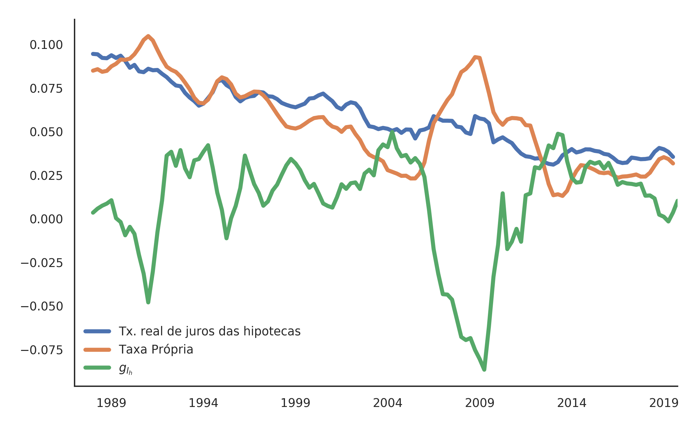

```{r setup, include=FALSE}
knitr::opts_chunk$set(echo = TRUE)
youngmetro::metro_beamer(fig_caption = FALSE)
```

## Estrutura da dissertação


\begin{block}{Objetivo}
Estudar as relações de médio prazo entre investimento residencial e dinâmica macroeconômica com bolha de ativos
\end{block}

1. Resenha da literatura teórica
2. Fatos estilizados e modelo empírico
3. Modelo SFC-SSM


## Revisão da literatura I

\begin{alert}{Problema deixado por Harrod}
Alternativas dentro da heterodoxia para resolver este problema:
\end{alert}

- Cambridge
- Kaleckiano tradicional (Oxford)
- Supermultiplicador Sraffiano (SSM)
- Kaleckiano híbrido (Kaleckiano  + SSM)

## Revisão da literatura II

- Modelos de crescimento com gastos autônomos não criadores de capacidade produtiva
- Investimento residencial nos modelos de crescimento

\begin{alert}{Conclusão parcial}
modelos estão mais centrados nas consequências e menos nos determinantes do
investimento residencial
\end{alert}

\begin{equation}
\tag{Duesenberry (1958)}
g_{I_h} = g_{I_h}(\underset{0}{g}, \underset{+}{\pi_t}, \underset{+}{\dot g_n})
\end{equation}

\begin{equation}
\tag{Teixeira (2015)}
g_{I_h} = \phi_0 - \phi_1\cdot\overbrace{\left(\frac{1+\overline r_{mo}}{1+\pi} - 1\right)}^{\text{own}}
\end{equation}


# Capítulo empírico

## Estrutura do capítulo

\begin{alert}{Objetivo}
Destacar a importância do investimento residencial para a dinâmica macroeconômica norte-americana e testar a capacidade explicativa da taxa própria de juros dos imóveis
\end{alert}

- Modelos de crescimento com gastos autônomos (revisão empírica)
- Investimento residencial e dinâmica macroeconômica

    + Fatos estilizados da economia norte-americana
    + Investimento residencial nos modelos macroeconométricos
    
- Estimação do VEC (EUA, 1992-2019)


## Fatos estlizados da economia norte-americana I


## Fatos estlizados da economia norte-americana II


## Fatos estlizados da economia norte-americana III


## Fatos estlizados da economia norte-americana IV


## Fatos estlizados da economia norte-americana V


## Estimação do modelo macroeconométrico


\begin{figure}
\centering
\includegraphics[height=.87\textheight]{./figs/ResultadoVecm.png}
\end{figure}

## Função resposta ao Impulso

\begin{figure}
\centering
\includegraphics[height=.9\textheight, width = 1.2\textwidth]{./figs/Impulso_VECM.png}
\end{figure}

## Decomposição para a variância


\begin{figure}
\centering
\includegraphics[height=.9\textheight, width = \textwidth]{./figs/FEVD_VECMpython_TxPropria.png}
\end{figure}


## Conclusões do modelo empírico

- Séries são cointegradas
- Taxa própria causa (no sentido de Granger) $g_{I_h}$

     + Afeta $g_{I_h}$ negativamente no curto prazo
     + É exogenamente fraco em relação à $g_{I_h}$
     
- $g_{I_h}$ é determinada positivamente pela demanda por imóveis por motivos não-especulativos
- Efeito de $g_{I_h}$ sobre o preço dos imóveis é desprezível 

    + Estoque de imóveis é muito maior que o fluxo de novos imóveis

# Modelo SFC-SSM

## Imóveis na metodologia SFC


## Estrutura do capítulo


\begin{alert}{Objetivo}
Construir um modelo SFC teórico que ajude explicar alguns dos fatos estilizados da economia norte-americana (1992-2019)
\end{alert}

- Breve apresentação da metodologia SFC
- Apresentação do modelo
- Solução analítica
- Simulações e choques

    + Inclusão de dados observados da taxa própria


## Matriz dos estoques


## Matriz dos fluxos


## Representação do [modelo](https://github.com/gpetrini/Dissertacao/blob/master/Modelo/Versoes/CapitalistConsumption.ipynb)


## Principais Equações


$$
Y = 
\begin{cases}
C_w =  W \\
C_k = R \cdot Z \hspace{5cm} \Delta L_k = C_k\\
I_f = h\cdot Y \hspace{5.25cm} \Delta h = h_{t-1}\cdot\gamma_u (u-u_N)\\
I_h = Z = (1+g_{I_h})\cdot I_{h_{t-1}} \hspace{2.5cm} \Delta MO = I_h
\end{cases}
$$
$$
g_{I_h} = \phi_0 - \phi_1\cdot \left(\frac{1+\overline r_{mo}}{1+\pi} - 1\right)
$$

$$
Z = I_h
$$
$$
K = K_f + K_h
$$

$$
\frac{K_f}{K} = \frac{h^*}{(1 - \omega)}
$$


## Simulação dos choques


## Comparação dos choques em relação ao *baseline*


## Imputando taxa própria observada I


## Imputando taxa própria observada II


## Imputando taxa própria observada III


## Conclusões do modelo SFC

- Reproduz as principais características do supermultiplicador sraffiano
    
    + $u\to u_N$
    + $g \to g_Z$
    + $\Delta \omega \nRightarrow g^*$: distribuição  não afeta o crescimento de LP
    
- Taxa de juros hipotecárias também impacta endividamento das famílias capitalistas
- Reproduz alguns fatos estilizados

\begin{alert}{Resultado particular}
$$\Uparrow g_{I_h} \Rightarrow \Downarrow \%K_h$$
\end{alert}

## Considerações finais

\begin{alert}{Modelo empírico}
Taxa própria de juros dos imóveis determina a --- mas não é determinada pela --- taxa de crescimento do investimento residencial e estas variáveis apresentam uma relação negativa de longo prazo
\end{alert}


\begin{alert}{Modelo SFC}
Modelo com dois tipos distintos de estoque de capital: produtivo (firmas) e os imóveis (famílias). Reprodução de alguns fatos estilizados por meio da inclusão de dados observados
\end{alert}

## Próximo passos

- Análise das relações entre mercado imobiliário e mercado de crédito
- Investigação de outros determinantes do investimento residencial que vão além da taxa própria

    + Examinar a aplicabilidade da taxa própria para além do caso norte-americano

- Aprofundar o entendimento da permissividade institucional e suas respectivas consequências sobre a dinâmica macroeconômica
- Compreender aumento da participação das hipotecas no balanço patrimonial dos bancos

## Referências centrais


Brochier & Macedo e Silva (2018): A supermultiplier Stock-Flow Consistent model: the "return" of the paradoxes of thrift and costs in the long run? 

Duesenberry, J. S. **Investment in housing**. In: Business cycle and economic growth. McGraw-Hill, 1958. (Economic Handbook Series).

Leamer (2007): Housing **IS** the Business Cycle

Serrano (1995): Long Period Effective Demand and the Sraffian Supermultiplier

Teixeira (2015): Crescimento liderado pela demanda na economia norte-americana nos anos 2000: uma análise a partir do supermultiplicador sraffiano com inflação de ativos

# Obrigado!

# Slides extras

## Evolução dos passivos por percentis de riqueza


## Participação do investimento residencial no PIB


## Taxa própria e investimento residencial



## Concenssão de crédito e mudanças institucionais


## Resíduos


\begin{figure}
\centering
\includegraphics[height=.87\textheight]{./figs/Residuos_4VECM.png}
\end{figure}


## Solução analítica

$$
Y_t = \frac{1}{1-\omega -h_t}\cdot (I_{h_t} + C_k)
$$

$$
g = g_Z + \frac{h_{t-1}\cdot \gamma_u (u-u_N)}{1-\omega-h_t} 
$$


$$
u\to u_N: g \to g_Z \hspace{1cm} h^* = \frac{g_Z\cdot v}{u_N} \hspace{1cm} g_K = f\frac{\overline s\cdot \overline u_N}{\overline v}
$$

$$
\frac{K_h}{K} = 1 - \frac{h^*}{(1 - \omega)}
$$


## Solução analítica de $k$: Passo a passo

$$
k = \frac{K_f}{K}
$$

$$
\frac{K_f}{K_h} = \frac{g_Z\cdot v}{u_N\cdot (1 - \omega - h^*)}
$$


$$
\frac{K_f}{K_h} = \frac{h^*}{(1 - \omega - h^*)}
$$


$$
\frac{K_h}{K} = 1 - \frac{h^*}{(1 - \omega)}
$$

## Choque em $\phi_0$ I


## Choque em $\phi_0$ II


## Choque em $\pi$ I


## Choque em $\pi$ II


## Choque em $\omega$ I


## Choque em $\omega$ II


## Choque em $r_{mo}$ I


## Choque em $r_{mo}$ II


## Análise de sensibilidade


